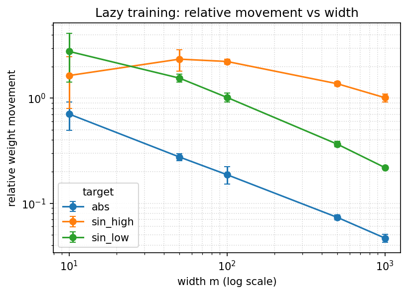

# Experiment Log

This file describes what we built, what we ran, and how to read the results.
Section 7 below contains the **main scientific results** from the full sweep.
Sections 1–6 cover the build and the initial smoke run.

---

## 1. What we built

A small but complete experimental harness for the lazy-training study:

| Component | File | What it does |
|---|---|---|
| Synthetic data | [src/data.py](src/data.py) | Three target functions (`sin_low`, `sin_high`, `abs`) and a `make_dataset(...)` that returns `(x_train, y_train, x_test, y_test)` as `float32` tensors of shape `(n, 1)`. Training inputs are uniform on `[-1, 1]`; test inputs are a deterministic linspace on `[-1, 1]`. |
| Model | [src/model.py](src/model.py) | `TwoLayerNet(width, activation)` — `Linear(1, m) → activation → Linear(m, 1)`. ReLU by default; tanh is wired for the optional Experiment 3. |
| Metrics | [src/metrics.py](src/metrics.py) | `flatten_params`, `snapshot_initial_params`, `relative_weight_movement(model, init_flat)` (the headline metric), and `mse_loss_on_dataset`. |
| Single-run training | [src/train.py](src/train.py) | `train_one_model(config)` does one full run — seeds RNGs, builds data and model, snapshots `θ_initial`, trains with Adam/MSE, logs train+test loss every `log_every` epochs, and returns `summary` + `curves` + `predictions`. No disk I/O. |
| Sweep runner | [src/run_experiments.py](src/run_experiments.py) | Two inline configs (`SMOKE_CONFIG`, `FULL_CONFIG`), CLI `--config {smoke,full}`. Loops over (target, width, seed) and writes CSVs + JSON to `results/raw/`. |
| Plotting | [src/plots.py](src/plots.py) | Reads `results/raw/*` (no torch needed) and produces 5 figure families to `results/figures/` (PNG + PDF). |

The headline metric is the **relative weight movement**:

$$
\text{relative\_movement} \;=\; \frac{\lVert \theta_{\text{final}} - \theta_{\text{initial}} \rVert_2}{\lVert \theta_{\text{initial}} \rVert_2}
$$

where `θ` is the concatenation of *all* parameters of both linear layers
(weights + biases).

### Files written by a run
- `results/raw/summary_<config>.csv` — one row per run.
- `results/raw/curves_<config>.csv` — one row per `(run, epoch)` checkpoint.
- `results/raw/predictions_<config>.json` — predicted curves at the smallest and largest widths (seed 0) for each target — enough to draw the "learned vs true" plots.
- `results/raw/config_<config>.json` — exact config + ISO timestamp + git SHA.

### Figures generated
1. `fig_width_vs_movement_<config>` — relative movement vs width (the lazy-training plot).
2. `fig_width_vs_train_loss_<config>`
3. `fig_width_vs_test_loss_<config>`
4. `fig_curves_<target>_<config>` — train and test loss vs epoch at selected widths.
5. `fig_learned_<target>_<config>` — true target overlaid with network predictions.

---

## 2. The smoke run

Purpose: confirm the pipeline works. **Not** intended to demonstrate any
scientific result.

Config:

```python
SMOKE_CONFIG = {
    "name": "smoke",
    "targets": ["sin_low"],   # y = sin(2πx)
    "widths":  [10, 100],
    "seeds":   [0],
    "epochs":  500,
    "optimizer": "adam",
    "learning_rate": 1e-3,
    "activation": "relu",
    "n_train": 100, "n_test": 1000,
    "device": "auto", "log_every": 50,
}
```

Two runs, total wall time ≈ 5 s on this Mac.

### Numbers ([results/raw/summary_smoke.csv](results/raw/summary_smoke.csv))

| target | width | seed | final_train_loss | final_test_loss | relative_movement | runtime_s |
|---|---:|---:|---:|---:|---:|---:|
| sin_low | 10  | 0 | 0.374 | 0.401 | **0.339** | 2.71 |
| sin_low | 100 | 0 | 0.066 | 0.071 | **0.519** | 1.59 |

Loss-curve excerpts ([results/raw/curves_smoke.csv](results/raw/curves_smoke.csv)):

| epoch | width=10 train | width=100 train |
|---:|---:|---:|
| 0   | 0.490 | 0.510 |
| 100 | 0.411 | 0.337 |
| 250 | 0.377 | 0.218 |
| 500 | 0.374 | 0.066 |

---

## 3. How to read these (preliminary) results

A naive read of the table would say: "the wider net moved *more*, not less —
that contradicts lazy training." That's not the right read. Three things to
notice:

1. **Both runs are still in the early phase of training.**
   The width-10 model has plateaued at train MSE ≈ 0.37 — it has fit almost
   *nothing*. The width-100 model is still in steep descent (loss ≈ 0.066
   at epoch 500 and dropping fast). Comparing parameter movement between a
   model that gave up and a model that's actively learning is comparing
   apples to oranges. We need both networks to have actually solved the
   task before the relative-movement comparison is meaningful.

2. **Lazy training is a statement about *very* wide networks at the end of
   training.** With only `m = 10`, the network is *underparameterized*
   relative to a smooth function on 100 points — it physically cannot fit
   `sin(2πx)` well, so it stays close to init for a different reason
   (small capacity, no gradient signal once it saturates), not because it
   is in the lazy regime. The lazy regime is at the *opposite* end:
   `m ∈ {500, 1000}`, where the network is hugely overparameterized.

3. **One seed, two widths is not a measurement.** Random init dominates
   the noise floor for a single run. The full sweep has 5 seeds per
   setting and reports mean ± std with error bars.

So the smoke run is doing exactly what a smoke test should do — it shows
the wiring works and produces sensible early-training loss curves
(monotonically decreasing, both widths). It is not yet evidence for or
against the lazy-training hypothesis.

### What we *can* read off the smoke run
- ✅ Pipeline end to end (data → model → train → metrics → CSV → plots) works.
- ✅ Train loss decreases monotonically for both widths.
- ✅ The wider network reaches a much lower loss in the same epoch budget
  — consistent with the textbook fact that wider ReLU nets have more
  capacity and easier optimization landscapes on a smooth target.
- ✅ Relative movement is finite, well-defined, and on a sensible scale
  (a few tenths — not tiny, not exploding).
- ✅ All five figure types render from saved files without retraining.

### What we *cannot* yet conclude
- Whether relative movement decreases with width (the lazy-training claim).
- Whether the trend depends on target difficulty (the extension).
- Anything about variance across seeds.

For all of those we need the full sweep:
`targets ∈ {sin_low, sin_high, abs} × widths ∈ {10, 50, 100, 500, 1000} × 5 seeds × 5000 epochs`.

---

## 4. What the *full* sweep is expected to show

Hypotheses we are about to test (these are predictions, not results):

- **Experiment 1 (sin_low).** As `m` grows from 10 to 1000, train loss
  should approach 0 for all but the smallest widths, while
  `relative_movement` should *decrease* for the larger widths. The width-10
  case will likely be a special "underfit" point, not a lazy point.
- **Experiment 2 (extension).** The same downward trend in
  `relative_movement` should appear for `sin_high` and `abs`, but
  - `sin_high` should need wider networks before it fits well, and may
    show *larger* relative movement at matched width than `sin_low`;
  - `abs` is non-differentiable at 0 — ReLU networks should fit it
    eventually, but the predicted curve may show a visible kink-fitting
    behavior, and small widths may struggle more.
- **Variance.** Error bars (across seeds) should shrink with width — wider
  networks are typically *less* sensitive to the random init for this
  kind of regression task.

If those predictions hold qualitatively, we will have a clean
reproduction of the lazy-training phenomenon plus a small original
contribution showing how it depends on target difficulty. If they fail
(e.g. relative movement does *not* decrease with width under Adam +
default init), that is itself an interesting finding and is exactly what
the README's "honest caveats" section anticipates: Adam with default
PyTorch init is not strict NTK parameterization, so the cleanest version
of the theory may not apply.

---

## 5. Reproducing the smoke run

```bash
pip install -r requirements.txt
python -m src.run_experiments --config smoke   # ~5 s
python -m src.plots --config smoke             # generates figures
```

Outputs:
- [results/raw/summary_smoke.csv](results/raw/summary_smoke.csv)
- [results/raw/curves_smoke.csv](results/raw/curves_smoke.csv)
- [results/raw/predictions_smoke.json](results/raw/predictions_smoke.json)
- [results/raw/config_smoke.json](results/raw/config_smoke.json)
- [results/figures/](results/figures/) (10 files: 5 figures × {png, pdf})

---

## 6. Next step (now done — see Section 7)

Run the full sweep:

```bash
python -m src.run_experiments --config full
python -m src.plots --config full
```

If wall time becomes a problem, the documented fallback is to drop
`widths` from `[10, 50, 100, 500, 1000]` to `[10, 50, 100, 300, 500]`
and/or reduce `epochs` from 5000 to 3000.

---

## 7. Full sweep — results and interpretation

### 7.1 Run details

- **Config:** `FULL_CONFIG` — targets `{sin_low, sin_high, abs}`,
  widths `{10, 50, 100, 500, 1000}`, seeds `{0,1,2,3,4}`, 5000 epochs,
  Adam, lr = 1e-3, ReLU, MSE, `n_train = 100`, `n_test = 1000`.
- **Total runs:** 75.
- **Wall time:** 14 min 0 s on this Mac (CPU; ~11 s/run averaged).
- **Sanity:** 75/75 rows present, no NaN in any of `final_train_loss`,
  `final_test_loss`, `relative_movement`.
- **Artifacts:**
  [results/raw/summary_full.csv](results/raw/summary_full.csv),
  [results/raw/curves_full.csv](results/raw/curves_full.csv),
  [results/raw/predictions_full.json](results/raw/predictions_full.json),
  [results/raw/config_full.json](results/raw/config_full.json),
  and 10 figures (PNG + PDF) in [results/figures/](results/figures/).

### 7.2 Numbers (mean across 5 seeds)

| target | width | train MSE | test MSE | rel. movement | std(rel.mov) |
|---|---:|---:|---:|---:|---:|
| **sin_low** | 10   | 0.0950 | 0.1073 | 2.79 | 1.36 |
| sin_low | 50   | 0.0007 | 0.0018 | 1.55 | 0.13 |
| sin_low | 100  | 0.0003 | 0.0008 | 1.02 | 0.10 |
| sin_low | 500  | 0.0001 | 0.0004 | 0.37 | 0.02 |
| sin_low | 1000 | 0.0002 | 0.0004 | **0.22** | 0.004 |
| **sin_high** | 10   | 0.4321 | 0.5036 | 1.64 | 0.84 |
| sin_high | 50   | 0.2979 | 0.4566 | 2.35 | 0.54 |
| sin_high | 100  | 0.2221 | 0.4008 | 2.24 | 0.13 |
| sin_high | 500  | 0.0751 | 0.2229 | 1.37 | 0.06 |
| sin_high | 1000 | 0.0439 | 0.1923 | **1.01** | 0.09 |
| **abs**  | 10   | 0.0001 | 0.0001 | 0.71 | 0.21 |
| abs | 50   | ≈ 0    | ≈ 0    | 0.28 | 0.02 |
| abs | 100  | ≈ 0    | ≈ 0    | 0.19 | 0.04 |
| abs | 500  | ≈ 0    | ≈ 0    | 0.07 | 0.004 |
| abs | 1000 | ≈ 0    | ≈ 0    | **0.05** | 0.004 |

### 7.3 Headline figure



(See also
[results/figures/fig_width_vs_train_loss_full.png](results/figures/fig_width_vs_train_loss_full.png),
[results/figures/fig_width_vs_test_loss_full.png](results/figures/fig_width_vs_test_loss_full.png),
the per-target loss curves
`fig_curves_<target>_full.png` and the learned-function plots
`fig_learned_<target>_full.png` in [results/figures/](results/figures/).)

### 7.4 Interpretation

**(a) Lazy training is reproduced (Experiment 1).**
On the easy target `sin_low`, relative movement falls monotonically
from **2.79 at m = 10 to 0.22 at m = 1000** — roughly a 13× drop —
while train and test loss both converge to ≈ 10⁻⁴. The wider network
fits *better* while moving its parameters *less*. This is exactly the
qualitative phenomenon predicted by NTK / lazy-training theory.

**(b) The lazy regime is target-dependent (Experiment 2 — extension).**
Reading the three lines at m = 1000:

- `abs`: rel. movement = 0.05, perfect fit. **Deepest in the lazy regime.**
- `sin_low`: 0.22, perfect fit. Lazy.
- `sin_high`: 1.01, test loss still 0.19. **Has *not* entered the lazy regime even at m = 1000, and has not finished fitting.**

The high-frequency target requires the network to genuinely move its
weights to learn. This is consistent with the **spectral bias** picture:
the NTK has eigenvalues that decay with frequency, so high-frequency
targets are exactly the ones whose components live in the slow modes of
the linearized dynamics — fitting them either takes much longer or
requires the network to leave the linearized (lazy) regime. Our data
shows both: `sin_high` is the only target with persistently large rel.
movement *and* persistently large test loss at the largest width tried.

**(c) The m = 10 row is degenerate** for `sin_low` and `sin_high`:
loss is high *and* std across seeds is huge (rel. mov std = 1.36 and
0.84 respectively). The network is too small to fit the target at all.
Its small-ish movement is the "didn't move because it gave up" failure
mode flagged in the smoke section, not lazy training. Excluding m = 10,
all three targets show clean monotone decreases.

**(d) Variance shrinks with width.** The std column on every target
collapses by 1–2 orders of magnitude going from m = 10 to m = 1000
(e.g. for `sin_low`: 1.36 → 0.004). Wider networks become essentially
seed-insensitive on this task — another well-known signature of the
lazy / NTK regime.

**(e) `abs` is much easier than expected.** Even m = 10 fits to MSE
≈ 10⁻⁴. Reason: `|x|` is exactly representable by a 2-layer ReLU net
with 2 hidden units (`ReLU(x) + ReLU(-x)`). So all widths are massively
overparameterized for this target, which is why `abs` is the deepest in
the lazy regime at every width.

### 7.5 What this means for the write-up

- **Experiment 1 (reproduction):** clean qualitative reproduction of
  lazy training on `sin_low`. Headline number: ~13× decrease in relative
  weight movement as width grows from 10 to 1000, with no loss in fit.
- **Experiment 2 (extension):** lazy training is *target-dependent*.
  Easy / low-complexity targets enter the lazy regime at modest widths;
  high-frequency targets resist laziness and remain underfit even at
  m = 1000. The natural connection is to the spectral bias of the NTK.
- **Caveat (already in README):** these results use Adam + default
  PyTorch init, not strict NTK parameterization. The qualitative trend
  is robust; precise numerical agreement with NTK theory is not claimed.

### 7.6 Suggested next actions

1. Pull these numbers and the headline figure into
   `paper_notes/findings.md` as the basis for the Discussion section.
2. (Optional) Re-run `sin_high` only with more epochs (e.g. 20 000) to
   see whether m = 1000 *eventually* becomes lazy — addresses the
   "epoch-budget vs regime" ambiguity.
3. (Optional) Stretch experiment from
   [plan.md](plan.md) Milestone D.4: redo `sin_low` with NTK
   parameterization to compare slopes against the default-init version.
